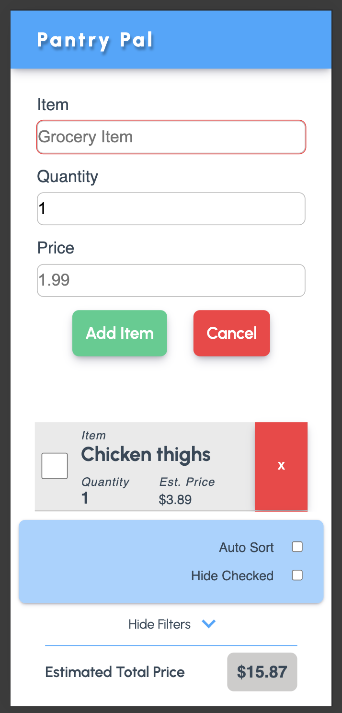

## Welcome to Pantry Pal

### Overview

While building apps with React, Vue, Angular or other libraries is often the go-to move - these libraries, and the frameworks available to them, abstract away the fundamentals. I built Pantry Pal as a way to get back in touch with the OGs:

- HTML
- Javascript
- CSS

To create some cheap and easy data persistence, and play-in to the theme of using native, and low-level APIs, we're using [indexDB](https://developer.mozilla.org/en-US/docs/Web/API/IndexedDB_API) and [Dexie](https://dexie.org/docs/).

We also employ a [Workbox Service Worker](https://developer.chrome.com/docs/workbox) to make the page available in offline mode to users - handy for those stores that always seem to be a cell-data wasteland!

### Versions

#### 1.0

- Create your shopping list easily, in one page
- Enjoy offline access to your shopping list
- Check items as 'in cart' but still see item details
- Hide checked items without deleting them
- View estimated trip total

#### 1.1 (currently working)

- Organize list by store category
- Improved quantity tracking
- Bundled code for improved performance

#### 1.2

- Edit list items
- Mass apply actions to the list

### Version 2

The user gets access to a pantry! The pantry is a lot like the shopping list, but intended to help keep track of what's actually in the house at any given time.

Once an item is checked off - it can be deleted or it can be transferred to the pantry. From the pantry you can track the amount left as needed, and pop it back on to your shopping list when you're out.

#### Design

Designs in this app have been kept simple - using CSS only for most things (even icons), and all designs are mobile-first.

