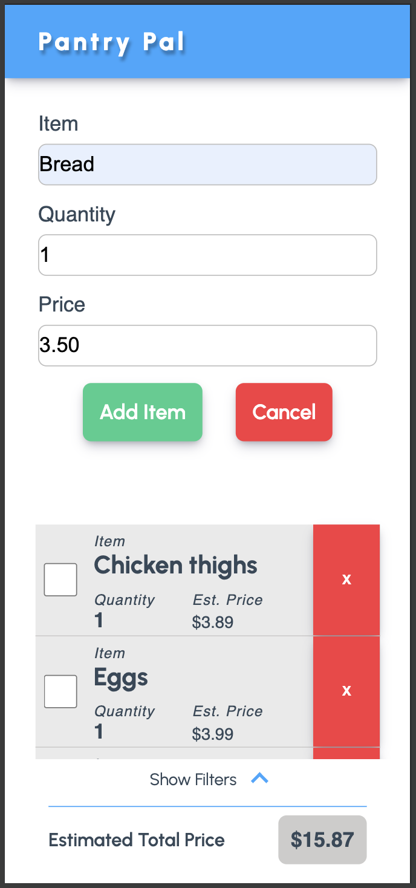

## Welcome to Pantry Pal

### Version 1.0

While building apps with React, Vue, Angular or other libraries is often the go-to move - these libraries, and the frameworks available to them, abstract away the fundamentals. I built Pantry Pal as a way to get back in tough with the OGs:

- HTML
- Javascript
- CSS

We also employ a Workbox Service Worker to make the page available in offline mode to users - handy for those stores that always seem to be a cell-data wasteland!

In version 1.0 we have several features:

- Create your shopping list easily, in one page
- Enjoy offline access to your shopping list
- Check items as 'in cart' but still see item details
- Hide checked items without deleting them
- Remove items one-by-one or all at once
- View estimated trip total

#### Design

Designs in this app have been kept simple - using CSS only for most things (even icons), and all designs are mobile-first.
